# Portuguese Numbers TTS System 🇧🇷🎵

A comprehensive system for generating Portuguese text with numbers and converting them to speech using multiple TTS providers, with detailed cost monitoring and analytics.

## 📋 Table of Contents

- [Overview](#overview)
- [Features](#features)
- [Architecture](#architecture)
- [Installation](#installation)
- [Usage](#usage)
- [Cost Monitoring](#cost-monitoring)
- [Project Structure](#project-structure)
- [API Providers](#api-providers)
- [Configuration](#configuration)
- [Examples](#examples)
- [Contributing](#contributing)

## 🎯 Overview

This system helps you learn Portuguese with voice aid, for example 
- Portuguese numbers by generating realistic text content with various numbers (years, populations, GDP, percentages) and converting them to speech using state-of-the-art TTS providers. 
- Portuguese conjugation examples through listening to examples.
It includes comprehensive cost monitoring to track your API usage and expenses.

### Key Benefits:
- **🎓 Educational**: Practice Portuguese number pronunciation
- **💰 Cost-Aware**: Track and monitor API expenses
- **🔄 Multi-Provider**: Compare different TTS voices
- **📊 Analytics**: Detailed usage statistics and reports
- **🛠️ Modular**: Easy to extend with new providers

## ✨ Features

### Text Generation
- **Random Paragraph Generation**: Creates realistic Portuguese text with numbers
- **Number Conversion**: Converts numbers to Brazilian Portuguese words
- **Multiple Text Types**: Supports various content types (statistics, verb conjugations)

### TTS Providers
- **OpenAI TTS**: High-quality speech synthesis
- **Google Gemini TTS**: Advanced AI-powered voice generation
- **Extensible**: Easy to add new TTS providers

### Cost Monitoring
- **Real-time Tracking**: Monitor costs as you generate audio
- **Daily Reports**: Automatic cost summaries by provider
- **JSON Storage**: Detailed request logs with timestamps
- **Token Counting**: Accurate token usage tracking
- **Error Monitoring**: Track failed requests and their costs

## 🏗️ Architecture

### System Overview


### Cost Monitoring Flow


### Data Flow Architecture


## 🚀 Installation

### Prerequisites
- Python 3.7+
- API keys for TTS providers

### Setup
1. **Clone the repository**:
   ```bash
   git clone <repository-url>
   cd Portuguese_Numbers
   ```

2. **Install dependencies**:
   ```bash
   pip install num2words openai requests
   ```

3. **Set up API keys**:
   ```bash
   export OPENAI_API_KEY="your-openai-key"
   export GEMINI_API_KEY="your-gemini-key"
   ```

## 📖 Usage

### Basic Usage

**Run both TTS providers**:
```bash
python main.py
```

**Run individual providers**:
```bash
# OpenAI only
python src/tts_providers/txt_to_voice_openai.py

# Gemini only
python src/tts_providers/txt_to_voice_gemini.py
```

### Example Output

```
Generated paragraph:
Em mil, novecentos e noventa e cinco, a população da cidade era de dois milhões, 
quatrocentos e cinquenta mil, setecentos e vinte habitantes. Em dois mil e vinte, 
esse número aumentou para três milhões, oitocentos e noventa mil, cento e trinta e 
quatro, representando um crescimento de doze vírgula três por cento.

Creating OpenAI TTS audio...
Started tracking request: request_001_openai
Completed tracking request: request_001_openai - Cost: $0.000123
Saved OpenAI TTS audio: audio_outputs/output_250928_001_openai.wav

Creating Gemini TTS audio...
Started tracking request: request_001_gemini
Completed tracking request: request_001_gemini - Cost: $0.000061
Saved Gemini TTS audio: audio_outputs/output_250928_001_gemini.wav

=== Daily Cost Report ===
Date: 2025-09-28
Total Requests: 2
Total Cost: $0.000184

By Provider:
  openai: 1 requests, $0.000123
  gemini: 1 requests, $0.000061
==============================
```

## 💰 Cost Monitoring

### Features
- **Automatic Tracking**: Every API call is automatically monitored
- **Daily Files**: Cost data saved to `token_cost_YYYY-MM-DD.json`
- **Request IDs**: Unique identifiers for each request (`request_001_openai`)
- **Real-time Reports**: Live cost updates during execution
- **Provider Breakdown**: Separate cost tracking per provider

### Audio File Management
- **Automatic Naming**: Files named as `output_YYmmdd_seqNum_provider.wav`
- **Date-based Organization**: Files organized by generation date
- **Request Correlation**: Audio files linked to cost tracking requests
- **Provider Identification**: Clear provider identification in filename

### Request Processing Flow


### Cost Calculation Process

```mermaid
flowchart TD
    A[Request Data] --> B[Provider Lookup]
    B --> C[Model Pricing]
    C --> D[Input Tokens]
    C --> E[Output Tokens]
    C --> F[Base Cost]
    
    D --> G[Input Cost = Tokens × Rate]
    E --> H[Output Cost = Tokens × Rate]
    F --> I[Base Request Cost]
    
    G --> J[Total Cost]
    H --> J
    I --> J
    
    J --> K[Save to JSON]
    K --> L[Update Daily Totals]
    L --> M[Generate Report]
```



### JSON Structure
```json
{
  "metadata": {
    "date": "2025-09-28",
    "total_requests": 2,
    "total_cost_usd": 0.000184,
    "providers": {
      "openai": {"requests": 1, "cost": 0.000123},
      "gemini": {"requests": 1, "cost": 0.000061}
    }
  },
  "requests": {
    "request_001_openai": {
      "timestamp": "2025-09-28T10:30:15.123456",
      "provider": "openai",
      "model": "gpt-4o-mini-tts",
      "input_tokens": 123,
      "output_tokens": 0,
      "cost_usd": 0.000123,
      "text_length": 492,
      "audio_duration": 30.5,
      "processing_time_seconds": 7.2,
      "success": true,
      "error": null
    }
  }
}
```

### Cost Calculation
- **OpenAI**: $1.00 per 1M input tokens
- **Gemini**: $0.50 per 1M input tokens (estimated)
- **Token Estimation**: ~4 characters per token for Portuguese text

## 📁 Project Structure


## 🔌 API Providers

### OpenAI TTS
- **Model**: `gpt-4o-mini-tts`
- **Voice**: `alloy` (configurable)
- **Format**: MPEG ADTS, layer III
- **Cost**: $1.00 per 1M tokens
- **Quality**: High-quality, natural speech

### Google Gemini TTS
- **Model**: `gemini-2.5-flash-preview-tts`
- **Language**: Brazilian Portuguese
- **Format**: WAV (PCM, 24kHz, 16-bit)
- **Cost**: $0.50 per 1M tokens (estimated)
- **Quality**: AI-powered, expressive speech

## ⚙️ Configuration

### Environment Variables
```bash
# Required API keys
OPENAI_API_KEY="sk-proj-..."
GEMINI_API_KEY="AIzaSy..."

# Optional: Custom output directory
OUTPUT_FOLDER="audio_outputs"
```

### Pricing Configuration
Edit `cost_monitor/pricing_config.py` to update provider pricing:

```python
self.pricing_data = {
    "openai": {
        "gpt-4o-mini-tts": {
            "input_tokens_per_dollar": 1000000,  # $1 per 1M tokens
            "output_tokens_per_dollar": 0,
            "base_request_cost": 0.0
        }
    },
    "gemini": {
        "gemini-2.5-flash-preview-tts": {
            "input_tokens_per_dollar": 2000000,  # $1 per 2M tokens
            "output_tokens_per_dollar": 0,
            "base_request_cost": 0.0
        }
    }
}
```

## 📊 Examples

### Generate Custom Text
```python
from src.text_generation.input_text_gen import generate_paragraph

# Generate a paragraph
text = generate_paragraph()
print(text)
```

### Use Individual TTS Providers
```python
from src.tts_providers.txt_to_voice_openai import tts_openai
from src.tts_providers.txt_to_voice_gemini import tts_gemini

# Generate audio with OpenAI (auto-generated filename)
openai_path = tts_openai("Olá, como você está?")

# Generate audio with Gemini (auto-generated filename)
gemini_path = tts_gemini("Olá, como você está?")

# Or specify custom filename
custom_path = tts_openai("Olá, como você está?", "custom_name.wav")
```

### Access Cost Data
```python
from cost_monitor.cost_tracker import CostTracker

tracker = CostTracker()

# Get today's summary
summary = tracker.get_daily_summary()
print(f"Total cost today: ${summary['total_cost_usd']}")

# Get specific request details
request_data = tracker.get_request_details("request_001_openai")
print(f"Request cost: ${request_data['cost_usd']}")

# Print daily report
tracker.print_daily_report()
```

## 🔧 Extending the System

### Adding a New TTS Provider

1. **Create provider file** in `src/tts_providers/`:
```python
# txt_to_voice_newprovider.py
from cost_monitor.cost_tracker import CostTracker

cost_tracker = CostTracker()

def tts_newprovider(text, filename):
    request_id = cost_tracker.start_request("newprovider", "model-name", text)
    
    try:
        # Your TTS API call here
        result = call_newprovider_api(text)
        
        # Save audio and track cost
        audio_path = save_audio_file(result, filename)
        cost_tracker.end_request(request_id, success=True)
        
        return audio_path
    except Exception as e:
        cost_tracker.end_request(request_id, success=False, error=str(e))
        return None
```

2. **Update pricing** in `cost_monitor/pricing_config.py`:
```python
"newprovider": {
    "model-name": {
        "input_tokens_per_dollar": 1000000,
        "output_tokens_per_dollar": 0,
        "base_request_cost": 0.0
    }
}
```

3. **Add to main orchestrator** in `main.py`:
```python
from src.tts_providers.txt_to_voice_newprovider import tts_newprovider

# In main() function
tts_newprovider(paragraph, "exercise_newprovider.wav")
```

## 🐛 Troubleshooting

### Common Issues

**Import Errors**:
```bash
# If running individual files, ensure you're in the project root
cd Portuguese_Numbers
python src/tts_providers/txt_to_voice_openai.py
```

**API Key Issues**:
```bash
# Check environment variables
echo $OPENAI_API_KEY
echo $GEMINI_API_KEY
```

**Audio File Issues**:
- Check `audio_outputs/` directory permissions
- Ensure sufficient disk space
- Verify API responses are valid

**Cost Tracking Issues**:
- Check `cost_monitor/` directory permissions
- Verify JSON file is writable
- Check for concurrent access issues

## 📈 Performance

### Benchmarks
- **OpenAI TTS**: ~7-8 seconds per request
- **Gemini TTS**: ~15-20 seconds per request
- **Cost per request**: $0.0001 - $0.0002 (typical)
- **Audio quality**: High (both providers)

### Optimization Tips
- Use shorter text for faster processing
- Batch multiple requests for better cost efficiency
- Monitor daily costs to stay within budget
- Use individual providers for specific use cases

## 🤝 Contributing

1. Fork the repository
2. Create a feature branch
3. Add your changes with tests
4. Update documentation
5. Submit a pull request

### Development Setup
```bash
# Install development dependencies
pip install -r requirements-dev.txt

# Run tests
python -m pytest tests/

# Format code
black src/ cost_monitor/
```

## 📄 License

This project is licensed under the MIT License - see the LICENSE file for details.

## 🙏 Acknowledgments

- **OpenAI** for providing high-quality TTS services
- **Google** for Gemini TTS capabilities
- **num2words** library for Portuguese number conversion
- **Brazilian Portuguese** language community

---

**Happy Learning! 🇧🇷🎵**

*Practice Portuguese numbers with AI-powered speech synthesis and never lose track of your costs!*