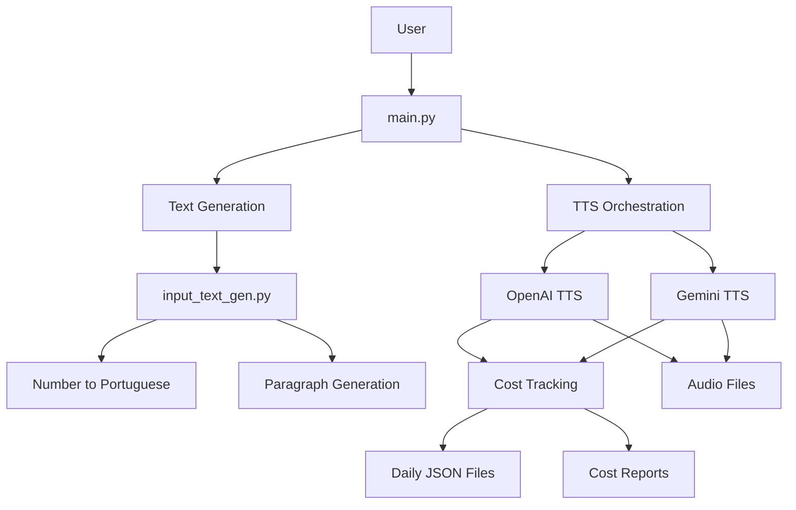
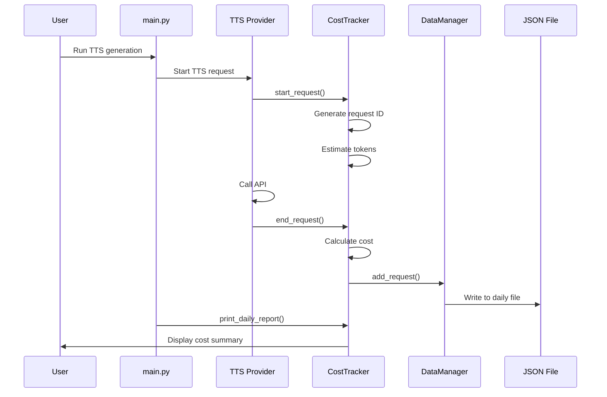
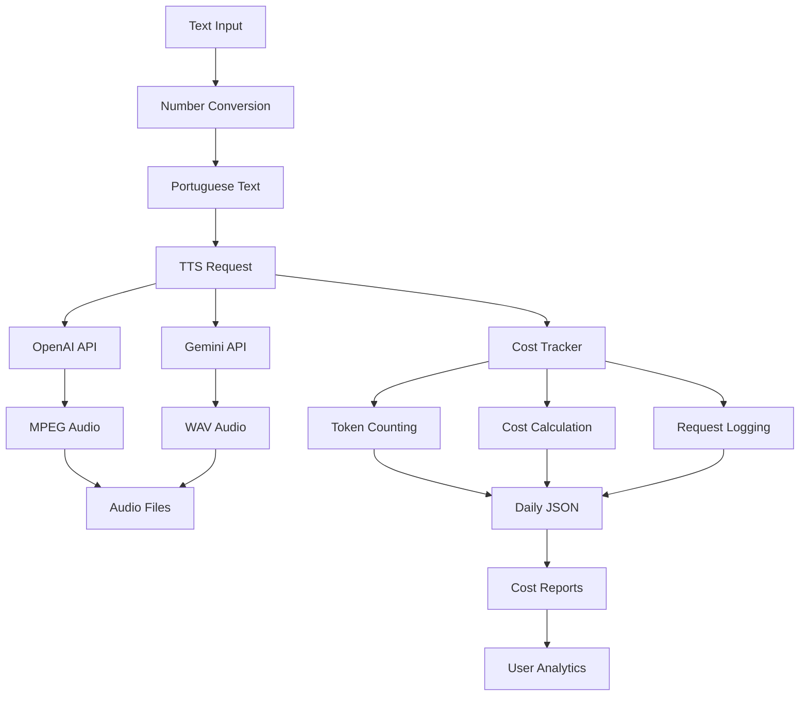
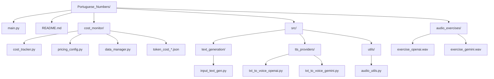
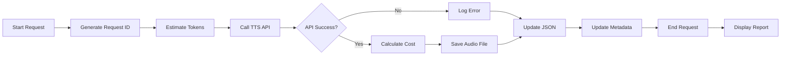
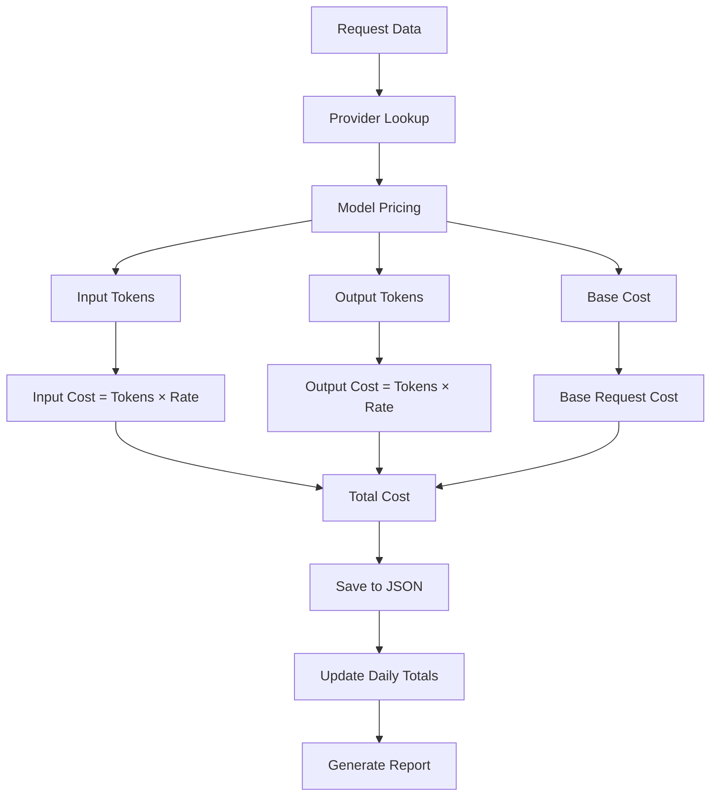

# System Diagrams

## System Architecture Overview

```mermaid
graph TB
    A[User] --> B[main.py]
    B --> C[Text Generation]
    B --> D[TTS Orchestration]
    
    C --> E[input_text_gen.py]
    E --> F[Number to Portuguese]
    E --> G[Paragraph Generation]
    
    D --> H[OpenAI TTS]
    D --> I[Gemini TTS]
    
    H --> J[Cost Tracking]
    I --> J
    
    J --> K[Daily JSON Files]
    J --> L[Cost Reports]
    
    H --> M[Audio Files]
    I --> M
```

## Cost Monitoring Flow

```mermaid
sequenceDiagram
    participant U as User
    participant M as main.py
    participant T as TTS Provider
    participant C as CostTracker
    participant D as DataManager
    participant J as JSON File
    
    U->>M: Run TTS generation
    M->>T: Start TTS request
    T->>C: start_request()
    C->>C: Generate request ID
    C->>C: Estimate tokens
    
    T->>T: Call API
    T->>C: end_request()
    C->>C: Calculate cost
    C->>D: add_request()
    D->>J: Write to daily file
    
    M->>C: print_daily_report()
    C->>U: Display cost summary
```

## Data Flow Architecture

```mermaid
flowchart TD
    A[Text Input] --> B[Number Conversion]
    B --> C[Portuguese Text]
    C --> D[TTS Request]
    
    D --> E[OpenAI API]
    D --> F[Gemini API]
    
    E --> G[MPEG Audio]
    F --> H[WAV Audio]
    
    G --> I[Audio Files]
    H --> I
    
    D --> J[Cost Tracker]
    J --> K[Token Counting]
    J --> L[Cost Calculation]
    J --> M[Request Logging]
    
    K --> N[Daily JSON]
    L --> N
    M --> N
    
    N --> O[Cost Reports]
    O --> P[User Analytics]
```

## File Structure Diagram

```mermaid
graph TD
    A[Portuguese_Numbers/] --> B[main.py]
    A --> C[README.md]
    A --> D[cost_monitor/]
    A --> E[src/]
    A --> F[audio_exercises/]
    
    D --> D1[cost_tracker.py]
    D --> D2[pricing_config.py]
    D --> D3[data_manager.py]
    D --> D4[token_cost_*.json]
    
    E --> E1[text_generation/]
    E --> E2[tts_providers/]
    E --> E3[utils/]
    
    E1 --> E1A[input_text_gen.py]
    E2 --> E2A[txt_to_voice_openai.py]
    E2 --> E2B[txt_to_voice_gemini.py]
    E3 --> E3A[audio_utils.py]
    
    F --> F1[exercise_openai.wav]
    F --> F2[exercise_gemini.wav]
```

## Request Processing Flow

```mermaid
flowchart LR
    A[Start Request] --> B[Generate Request ID]
    B --> C[Estimate Tokens]
    C --> D[Call TTS API]
    D --> E{API Success?}
    
    E -->|Yes| F[Calculate Cost]
    E -->|No| G[Log Error]
    
    F --> H[Save Audio File]
    G --> I[Update JSON]
    H --> I
    
    I --> J[Update Metadata]
    J --> K[End Request]
    
    K --> L[Display Report]
```

## Cost Calculation Process

```mermaid
flowchart TD
    A[Request Data] --> B[Provider Lookup]
    B --> C[Model Pricing]
    C --> D[Input Tokens]
    C --> E[Output Tokens]
    C --> F[Base Cost]
    
    D --> G[Input Cost = Tokens × Rate]
    E --> H[Output Cost = Tokens × Rate]
    F --> I[Base Request Cost]
    
    G --> J[Total Cost]
    H --> J
    I --> J
    
    J --> K[Save to JSON]
    K --> L[Update Daily Totals]
    L --> M[Generate Report]
```
