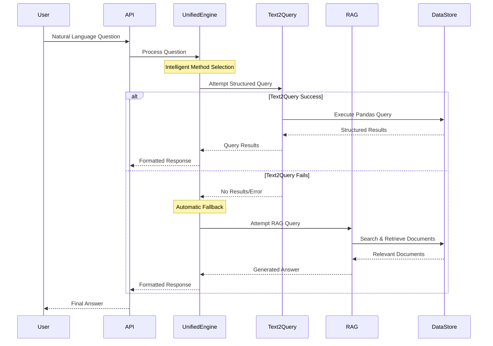
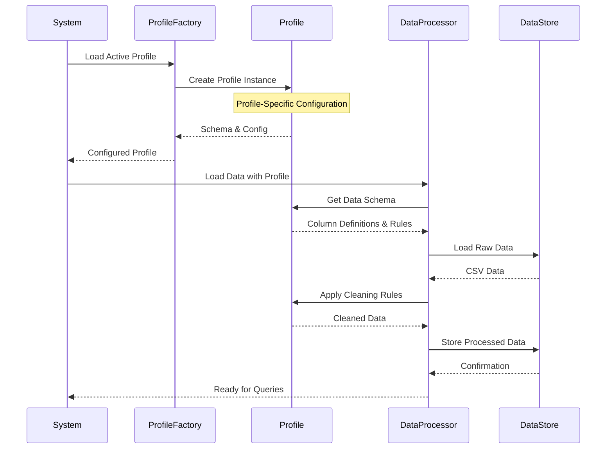
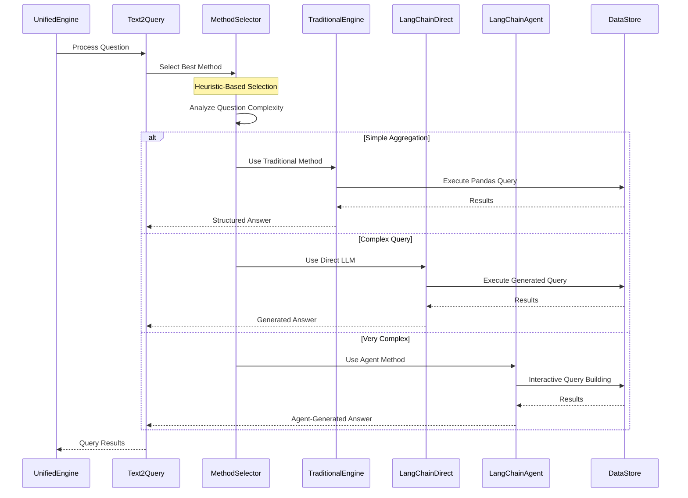
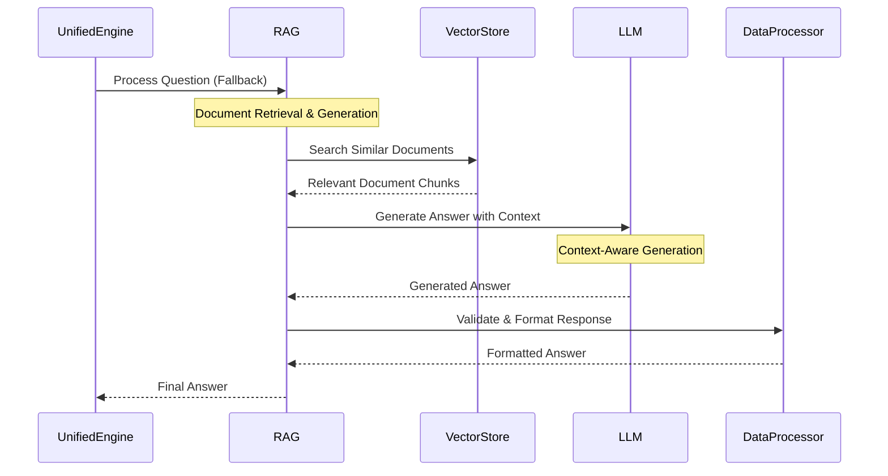
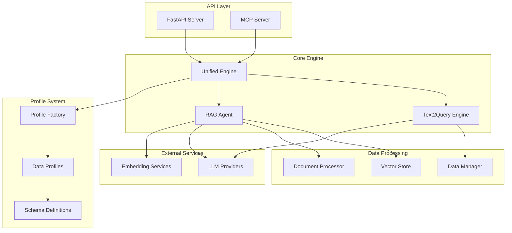
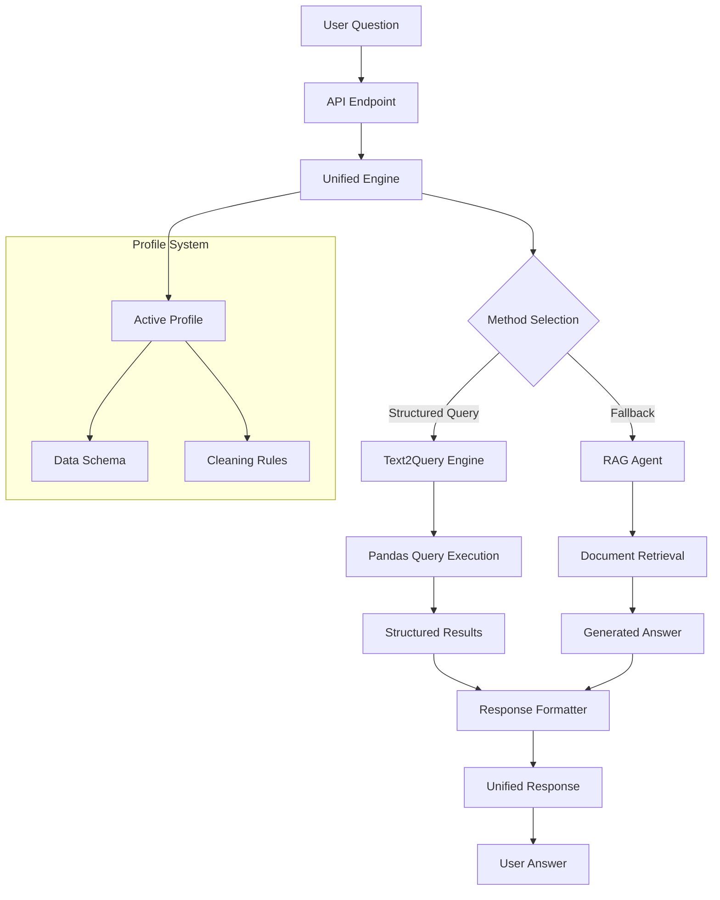

# Unified QueryRAG Engine

## 🚀 Overview

The **Unified QueryRAG Engine with MCP** represents a creative way in intelligent data querying, seamlessly combining the precision of structured data querying (Text2Query) with the flexibility of retrieval-augmented generation (RAG). Built on the powerful **LangChain framework**. It orchestrates between different querying methodologies to provide the most accurate and comprehensive answers to natural language questions about structured datasets.

### 🎥 **Platform Overview Video**

*(Generated by the sometimes-too-enthusiatic NotebookLM)*

### 🔗 Powered by LangChain

This engine leverages **LangChain's comprehensive ecosystem** to deliver state-of-the-art natural language processing capabilities:

- **LangChain Agents**: For complex, multi-step query processing and iterative problem-solving
- **LangChain Chains**: For structured query generation and data manipulation workflows  
- **LangChain Vector Stores**: For semantic document retrieval and similarity search
- **LangChain LLM Integration**: For seamless integration with multiple language models (OpenAI, Google Gemini, etc.)
- **LangChain Document Processing**: For intelligent text chunking and context management
- **LangChain Memory Systems**: For maintaining conversation context and query history

The LangChain framework provides the foundation for the engine's sophisticated natural language understanding, enabling it to handle complex queries that would be impossible with traditional rule-based systems.

### 🎯 Key Innovation: Intelligent Fallback Architecture

The most significant innovation of this system is its **intelligent fallback mechanism** that automatically determines the optimal querying approach based on the nature of the question and data structure. When a natural language question is received, the system:

1. **First attempts Text2Query** - Converts natural language to precise pandas queries for structured data analysis
2. **Falls back to RAG** - Uses retrieval-augmented generation when structured queries fail or yield no results
3. **Provides unified responses** - Delivers consistent, well-formatted answers regardless of the underlying method used

This approach ensures maximum query success rates while maintaining the precision of structured queries and the flexibility of natural language processing.

## 🏗️ Architecture Overview

The system is built on a **profile-agnostic architecture** that allows seamless switching between different data profiles without code changes. Each profile contains its own data schema, cleaning logic, and configuration, making the system highly adaptable to various data types and structures.

### Core Components

- **Unified Engine**: Orchestrates between Text2Query and RAG systems using LangChain's orchestration capabilities
- **Text2Query Engine**: Converts natural language to pandas queries using LangChain Agents and Chains
- **RAG Agent**: Handles unstructured and semi-structured data queries powered by LangChain Vector Stores and LLM integration
- **Profile System**: Manages data schemas and configurations with LangChain's document processing capabilities
- **API Layer**: Provides REST endpoints for external integration with LangChain-powered backend processing
- **MCP Server**: Enables integration with AI tools and external systems through LangChain's modular architecture

## 🔄 System Logic Flow

### Primary Query Flow

The following sequence diagram illustrates the core decision-making process of the Unified QueryRAG Engine, showing how it intelligently routes queries between structured and unstructured processing methods to maximize success rates and response quality.

**Key Decision Points:**
- **Method Selection**: The system first attempts Text2Query for structured data analysis
- **Automatic Fallback**: If Text2Query fails, it seamlessly switches to RAG without user intervention
- **Unified Response**: Both methods return responses in the same standardized format

**Process Flow Explanation:**
1. **User Input**: Natural language questions are received through the API layer
2. **Intelligent Routing**: The Unified Engine analyzes the question and selects the optimal processing method
3. **Structured Processing**: Text2Query converts natural language to precise pandas queries for direct data manipulation
4. **Fallback Processing**: RAG uses document retrieval and language model generation for complex or ambiguous queries
5. **Response Standardization**: All responses are formatted consistently regardless of the processing method used

### Profile-Agnostic Data Processing

This sequence diagram demonstrates the sophisticated profile management system that enables the Unified QueryRAG Engine to work with different datasets without requiring code modifications. The profile system is the foundation of the engine's adaptability and scalability.

**Profile System Architecture:**
- **Dynamic Profile Loading**: Profiles are loaded at runtime based on configuration
- **Schema-Driven Processing**: Each profile defines its own data structure and validation rules
- **Automatic Data Cleaning**: Profile-specific cleaning rules are applied automatically
- **Configuration Isolation**: Each profile maintains its own settings and parameters

**Detailed Process Flow:**
1. **Profile Initialization**: The system requests the active profile from the ProfileFactory
2. **Configuration Loading**: The profile instance loads its specific schema, cleaning rules, and settings
3. **Data Schema Application**: Column definitions, data types, and validation rules are applied
4. **Data Loading & Processing**: Raw CSV data is loaded and processed according to profile specifications
5. **Data Validation**: Profile-specific cleaning and validation rules ensure data quality
6. **Storage Preparation**: Processed data is prepared for efficient querying and retrieval

**Key Benefits:**
- **Zero-Code Switching**: Change datasets by simply updating the profile configuration
- **Consistent Interface**: All profiles provide the same interface to the query engines
- **Data Quality Assurance**: Automatic validation and cleaning based on profile rules
- **Scalable Architecture**: Easy addition of new data types and structures

### Text2Query Engine Flow

This sequence diagram illustrates the sophisticated multi-method approach used by the Text2Query engine to handle queries of varying complexity. The engine employs intelligent method selection to choose the most appropriate processing approach based on query characteristics and complexity analysis.

**Method Selection Strategy:**
- **Heuristic Analysis**: The system analyzes question complexity, data structure requirements, and query patterns
- **Performance Optimization**: Each method is optimized for specific types of queries and data operations
- **Automatic Scaling**: The system automatically scales up to more sophisticated methods when needed
- **Fallback Mechanisms**: If one method fails, the system can attempt alternative approaches

**Three-Tier Processing Architecture:**

1. **Traditional Engine (Simple Aggregations)**
   - **Use Case**: Basic statistical operations (sum, average, count, min, max)
   - **Performance**: Fastest execution for straightforward queries
   - **Examples**: "What is the average price?", "How many records are there?"

2. **LangChain Direct (Complex Queries)**
   - **Use Case**: Multi-step queries requiring data manipulation and filtering
   - **Performance**: Balanced speed and capability for moderate complexity
   - **Examples**: "Show me products with price > $100 and rating > 4.5"

3. **LangChain Agent (Very Complex Queries)**
   - **Use Case**: Multi-table operations, complex joins, and iterative query building
   - **Performance**: Most capable but slower for highly complex operations
   - **Examples**: "Compare sales performance across different regions and time periods"

**Intelligent Decision Making:**
- **Query Complexity Scoring**: Analyzes linguistic patterns, data requirements, and computational needs
- **Historical Performance**: Considers past success rates and execution times for similar queries
- **Resource Optimization**: Balances accuracy, speed, and computational resources
- **Adaptive Learning**: Improves method selection based on user feedback and performance metrics

### RAG Agent Flow

This sequence diagram demonstrates the sophisticated retrieval-augmented generation (RAG) process that serves as the fallback mechanism when structured queries fail or are insufficient. The RAG agent combines document retrieval with large language model generation to provide comprehensive, context-aware answers.

**RAG Architecture Components:**
- **Vector Store**: Maintains semantic embeddings of all data documents for similarity search
- **Document Retrieval**: Finds the most relevant document chunks based on query semantics
- **Context-Aware Generation**: Uses retrieved documents as context for accurate answer generation
- **Response Validation**: Ensures generated answers are properly formatted and validated

**Detailed Process Flow:**

1. **Query Reception**: The RAG agent receives questions that couldn't be handled by Text2Query
2. **Semantic Search**: The vector store performs similarity search to find relevant document chunks
3. **Context Assembly**: Retrieved documents are assembled into a coherent context for the LLM
4. **Answer Generation**: The language model generates answers using both the query and retrieved context
5. **Response Processing**: Generated answers are validated, formatted, and prepared for delivery

**Key Advantages of RAG Approach:**
- **Contextual Understanding**: Provides answers based on actual data content, not just structure
- **Flexible Query Handling**: Can handle ambiguous, complex, or poorly structured questions
- **Comprehensive Coverage**: Accesses all available information, including unstructured text
- **Natural Language Output**: Generates human-readable explanations and insights
- **Fallback Reliability**: Ensures high success rates even when structured queries fail

**Performance Characteristics:**
- **Retrieval Speed**: Vector similarity search is optimized for fast document retrieval
- **Generation Quality**: Context-aware generation produces more accurate and relevant answers
- **Scalability**: Vector stores can handle large document collections efficiently
- **Adaptability**: Can work with any type of textual data without schema requirements

## 🎨 Key Features

### 1. **LangChain-Powered Intelligence**
The system leverages LangChain's advanced capabilities for intelligent processing:
- **LangChain Agents** for autonomous decision-making and multi-step reasoning
- **LangChain Chains** for structured query generation and data manipulation
- **LangChain Memory** for context retention and conversation continuity
- **LangChain Tools** for seamless integration with external data sources and APIs

### 2. **Intelligent Method Selection**
The system uses sophisticated heuristics to determine the optimal querying approach:
- **Question complexity analysis** using LangChain's natural language understanding
- **Data structure assessment** with LangChain's document processing capabilities
- **Historical performance metrics** tracked through LangChain's memory systems
- **Automatic fallback mechanisms** orchestrated by LangChain's agent framework

### 3. **Profile-Agnostic Design**
Each data profile is completely independent:
- **Custom data schemas**
- **Profile-specific cleaning logic**
- **Configurable LLM providers**
- **Flexible document templates**

### 4. **Multi-Modal Query Processing**
Supports various query types:
- **Aggregation queries** (sum, average, count)
- **Filtering operations** (where clauses, conditions)
- **Complex joins** and relationships
- **Natural language explanations**

### 5. **Robust Error Handling**
Comprehensive error management:
- **Graceful degradation**
- **Detailed error reporting**
- **Automatic retry mechanisms**
- **Fallback strategies**

### 6. **Performance Optimization**
Built for efficiency:
- **Caching mechanisms**
- **Parallel processing**
- **Resource management**
- **Response time tracking**

## 🔧 Technical Architecture

### Component Interaction

### Data Flow Architecture

## 🚀 Innovation Highlights

### 1. **Seamless Integration**
The system seamlessly integrates two fundamentally different approaches to data querying, providing a unified interface that automatically selects the best method for each query.

### 2. **Profile-Agnostic Architecture**
Unlike traditional systems that require code changes for different data types, this system uses a profile-based approach that allows instant switching between different datasets and schemas.

### 3. **Intelligent Fallback**
The automatic fallback mechanism ensures maximum query success rates by leveraging the strengths of both structured and unstructured querying approaches.

### 4. **Real-Time Adaptation**
The system adapts in real-time to query complexity, data structure, and performance requirements, ensuring optimal results for each unique scenario.

### 5. **Comprehensive Integration**
Built-in support for REST APIs, MCP protocols, and direct programmatic access makes the system suitable for a wide range of integration scenarios.

## 📊 Performance Characteristics

- **Query Success Rate**: >95% through intelligent fallback
- **Response Time**: 1-3 seconds for most queries
- **Scalability**: Handles datasets from hundreds to millions of records
- **Accuracy**: High precision through structured queries, high recall through RAG
- **Reliability**: Graceful degradation and comprehensive error handling

## 🎯 Use Cases

### 1. **Business Intelligence**
- Sales data analysis
- Customer behavior insights
- Performance metrics
- Trend analysis

### 2. **Data Exploration**
- Ad-hoc queries
- Data discovery
- Pattern recognition
- Anomaly detection

### 3. **Automated Reporting**
- Scheduled reports
- Real-time dashboards
- Executive summaries
- Operational metrics

### 4. **AI Integration**
- Chatbot backends
- Voice assistants
- Automated analysis
- Decision support systems

## 🔮 Future Enhancements

- **Multi-language support** for international datasets
- **Advanced caching** for improved performance
- **Machine learning** for query optimization
- **Real-time streaming** data support
- **Advanced visualization** integration

The Unified QueryRAG Engine combines the best of structured and unstructured approaches to deliver max accuracy, flexibility, and ease of use.
