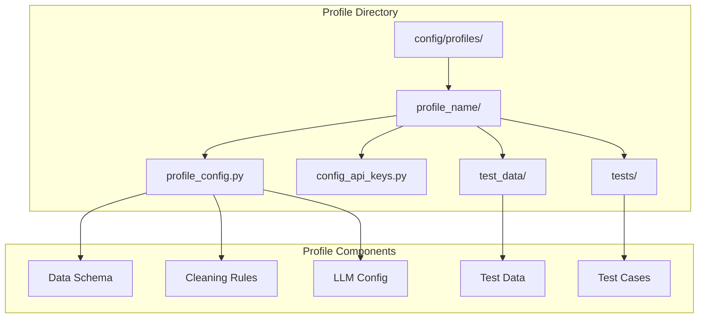
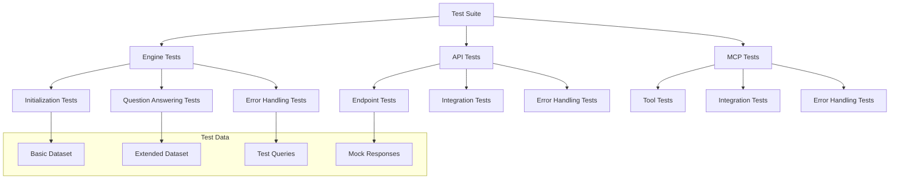
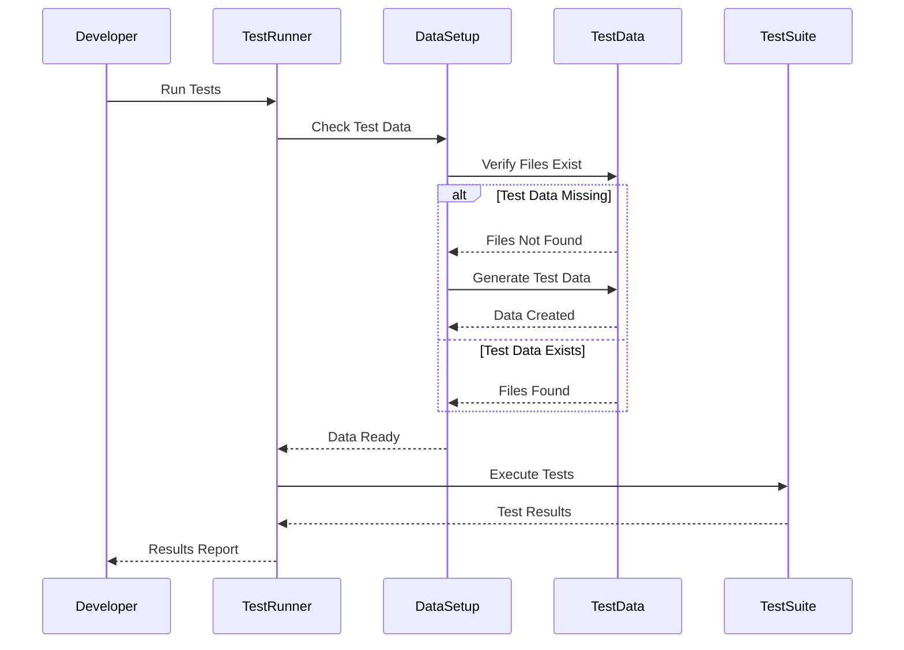
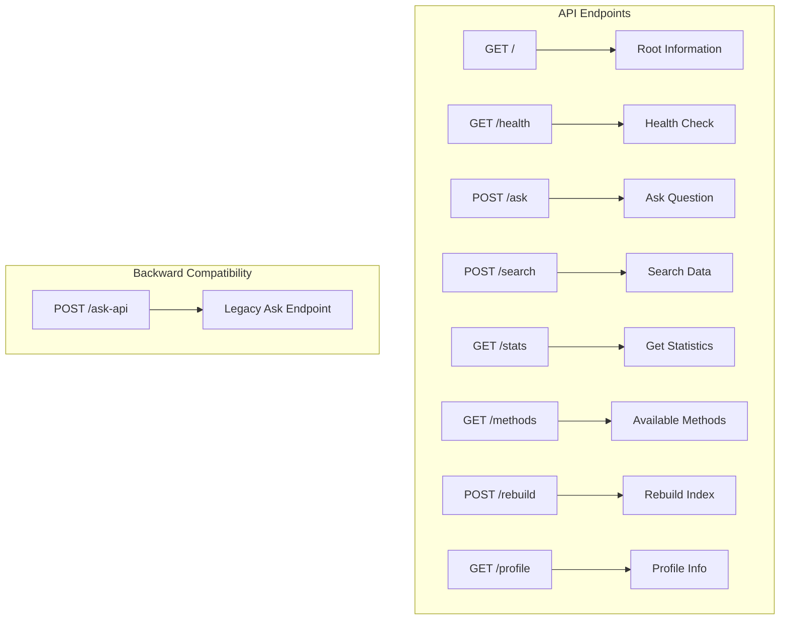
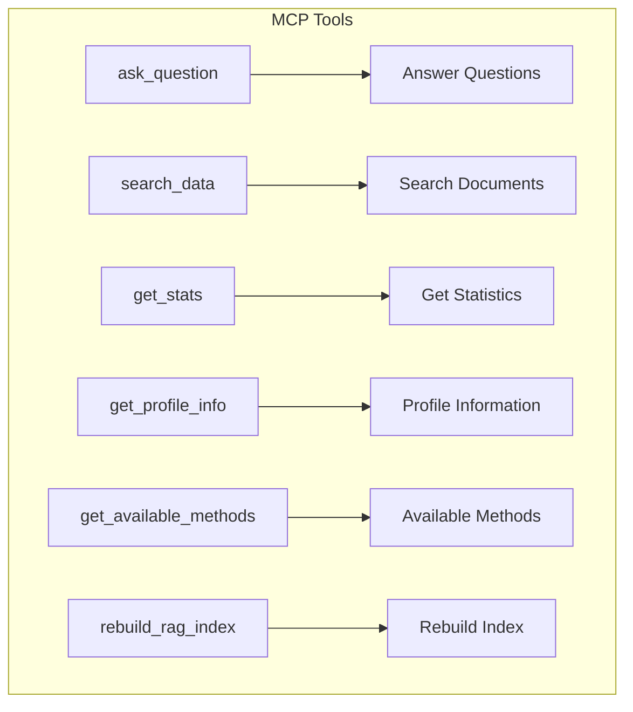
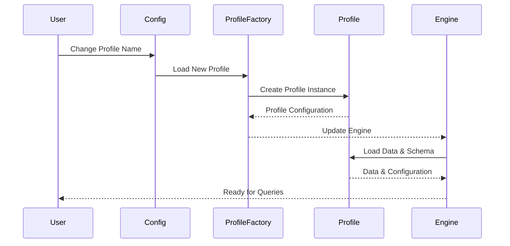

# Setup Guide for Unified QueryRAG Engine

## 🚀 Quick Start

This guide will walk you through setting up and running the Unified QueryRAG Engine, including testing, server deployment, and profile management.

## 📋 Prerequisites

- Python 3.11+
- Git
- API keys for LLM providers (Google Gemini, OpenAI, etc.)

## 🏗️ Installation

### 1. Clone the Repository
```bash
git clone <repository-url>
cd ultra_plus_queryRagMcp
```

### 2. Install Dependencies
```bash
pip install -r requirements.txt
```

### 3. Set Up Environment
```bash
# Copy the API keys template
cp config/profiles/default_profile/config_api_keys_template.py config/profiles/default_profile/config_api_keys.py

# Edit the API keys file with your actual keys
nano config/profiles/default_profile/config_api_keys.py
```

## 🎯 Profile System Overview

The Unified QueryRAG Engine uses a **profile-agnostic architecture** that allows you to work with different datasets without changing any code. Each profile is completely self-contained and includes:

- **Data schema definitions**
- **Cleaning and preprocessing rules**
- **LLM provider configurations**
- **Document templates**
- **Test data and configurations**

### Profile Structure



## 🧪 Testing Guide

### Test Structure Overview



### Running Tests

#### 1. Set Up Test Data
```bash
# Navigate to the test directory
cd config/profiles/default_profile/tests

# Set up test data
python setup_test_data.py

# Verify test data
python setup_test_data.py verify
```

#### 2. Run All Tests
```bash
# From project root
python config/profiles/default_profile/tests/run_unified_tests.py all
```

#### 3. Run Specific Test Suites
```bash
# Engine tests only
python config/profiles/default_profile/tests/run_unified_tests.py engine

# API tests only
python config/profiles/default_profile/tests/run_unified_tests.py api

# MCP tests only
python config/profiles/default_profile/tests/run_unified_mcp.py mcp

# Quick tests (unit tests only)
python config/profiles/default_profile/tests/run_unified_tests.py quick

# Integration tests only
python config/profiles/default_profile/tests/run_unified_tests.py integration
```

#### 4. Run Individual Tests
```bash
# Using pytest directly
pytest config/profiles/default_profile/tests/test_unified_engine.py -v

# Run specific test class
pytest config/profiles/default_profile/tests/test_unified_engine.py::TestUnifiedEngineInitialization -v

# Run specific test method
pytest config/profiles/default_profile/tests/test_unified_engine.py::TestUnifiedEngineInitialization::test_engine_initialization_success -v
```

### Test Data Management



## 🖥️ Server Setup

### 1. FastAPI Server

#### Start the API Server
```bash
# Using the provided script
python scripts/run_unified_api.py

# Or using uvicorn directly
uvicorn api.unified_api:app --host 0.0.0.0 --port 7788 --reload
```

#### API Endpoints


#### Test API Endpoints
```bash
# Health check
curl http://localhost:7788/health

# Ask a question
curl -X POST http://localhost:7788/ask \
  -H "Content-Type: application/json" \
  -d '{"question": "What is the average price of Samsung fridges?", "method": "auto"}'

# Search data
curl -X POST http://localhost:7788/search \
  -H "Content-Type: application/json" \
  -d '{"query": "Samsung fridges", "top_k": 10}'

# Get statistics
curl http://localhost:7788/stats
```

### 2. MCP Server

#### Start the MCP Server
```bash
# Using the provided script
python scripts/run_unified_mcp.py

# Or using the server directly
python servers/unified_mcp_server.py
```

#### MCP Tools Available


## 🔧 Profile Management

### Creating a New Profile

#### 1. Create Profile Directory
```bash
mkdir -p config/profiles/your_profile_name
```

#### 2. Create Profile Configuration
```python
# config/profiles/your_profile_name/profile_config.py
from ..base_profile import BaseProfile, ColumnDefinition, SensitizationRule

class YourProfile(BaseProfile):
    """Your custom profile configuration."""
    
    def __init__(self):
        super().__init__()
        self.profile_name = "your_profile_name"
        self.language = "en-US"
        self.locale = "en_US"
        
    def get_data_file_path(self) -> str:
        return str(self.get_test_data_path() / "your_data.csv")
    
    def get_required_columns(self) -> List[str]:
        return ["ID", "NAME", "VALUE", "DATE"]
    
    def get_sensitive_columns(self) -> List[str]:
        return ["ID"]
    
    def get_text_columns(self) -> List[str]:
        return ["NAME", "DESCRIPTION"]
    
    def clean_data(self, df: pd.DataFrame) -> pd.DataFrame:
        # Your custom cleaning logic
        return df
```

#### 3. Create API Keys Configuration
```python
# config/profiles/your_profile_name/config_api_keys.py
# Copy from template and update with your keys
```

#### 4. Add Test Data
```bash
# Create test data directory
mkdir -p config/profiles/your_profile_name/test_data

# Add your CSV data
cp your_data.csv config/profiles/your_profile_name/test_data/
```

#### 5. Create Tests
```bash
# Create tests directory
mkdir -p config/profiles/your_profile_name/tests

# Copy test templates
cp config/profiles/default_profile/tests/test_*.py config/profiles/your_profile_name/tests/
```

### Profile Switching



#### Switch Profiles
```python
# In config/settings.py
PROFILE = "your_profile_name"  # Change this line

# Restart the server
python scripts/run_unified_api.py
```

## 🔍 Configuration

### Environment Variables
```bash
# Logging
export LOG_LEVEL=INFO
export LOG_TO_FILE=true
export LOG_TO_CONSOLE=true

# API Configuration
export API_PORT=7788
export MCP_PORT=7800

# Profile Configuration
export PROFILE_NAME=default_profile
```

### Configuration Files

#### Main Settings
```python
# config/settings.py
PROFILE = "default_profile"  # Active profile
GENERATION_MODEL = "gemini-1.5-flash"
API_PORT = 7788
MCP_PORT = 7800
```

#### Profile-Specific Settings
```python
# config/profiles/your_profile/profile_config.py
class YourProfile(BaseProfile):
    # Profile-specific configuration
    pass
```

## 🚀 Deployment

### Development Deployment
```bash
# Start API server
python scripts/run_unified_api.py

# Start MCP server (in another terminal)
python scripts/run_unified_mcp.py
```

### Production Deployment

#### Using Docker
```dockerfile
# Dockerfile
FROM python:3.11-slim

WORKDIR /app
COPY requirements.txt .
RUN pip install -r requirements.txt

COPY . .
EXPOSE 7788

CMD ["python", "scripts/run_unified_api.py"]
```

#### Using Systemd
```ini
# /etc/systemd/system/unified-queryrag.service
[Unit]
Description=Unified QueryRAG Engine
After=network.target

[Service]
Type=simple
User=your_user
WorkingDirectory=/path/to/ultra_plus_queryRagMcp
ExecStart=/usr/bin/python3 scripts/run_unified_api.py
Restart=always

[Install]
WantedBy=multi-user.target
```

## 🔧 Troubleshooting

### Common Issues

#### 1. Import Errors
```bash
# Ensure you're in the project root
cd /path/to/ultra_plus_queryRagMcp

# Check Python path
export PYTHONPATH=$PYTHONPATH:$(pwd)
```

#### 2. API Key Issues
```bash
# Verify API keys are set
python -c "from config.profiles.default_profile.config_api_keys import *; print('API keys loaded')"
```

#### 3. Test Failures
```bash
# Check test data
python config/profiles/default_profile/tests/setup_test_data.py verify

# Run tests with verbose output
pytest config/profiles/default_profile/tests/ -v -s
```

#### 4. Server Issues
```bash
# Check if port is available
netstat -tulpn | grep :7788

# Check logs
tail -f logs/unified_engine.log
```

### Performance Tuning

#### 1. Memory Optimization
```python
# In profile configuration
def get_sample_size(self) -> int:
    return 1000  # Limit data size for testing
```

#### 2. Response Time Optimization
```python
# In settings
CHUNK_SIZE = 500  # Smaller chunks for faster processing
TOP_K = 10  # Limit search results
```

## 📊 Monitoring

### Health Checks
```bash
# API health
curl http://localhost:7788/health

# MCP health
curl http://localhost:7800/health
```

### Logging
```bash
# View logs
tail -f logs/unified_engine.log
tail -f logs/api.log
tail -f logs/mcp.log
```

### Metrics
```bash
# Get statistics
curl http://localhost:7788/stats

# Get performance metrics
curl http://localhost:7788/methods
```

## 🎯 Best Practices

### 1. Profile Development
- Keep profiles self-contained
- Use descriptive column names
- Implement proper data cleaning
- Add comprehensive tests

### 2. Testing
- Run tests before deployment
- Use realistic test data
- Test error scenarios
- Monitor performance

### 3. Deployment
- Use environment variables for configuration
- Implement proper logging
- Set up monitoring
- Plan for scaling

### 4. Maintenance
- Regular data updates
- Performance monitoring
- Log analysis
- Security updates

This setup guide provides everything you need to get started with the Unified QueryRAG Engine, from basic installation to advanced deployment scenarios. The profile-agnostic architecture ensures that you can easily adapt the system to your specific data and requirements.
